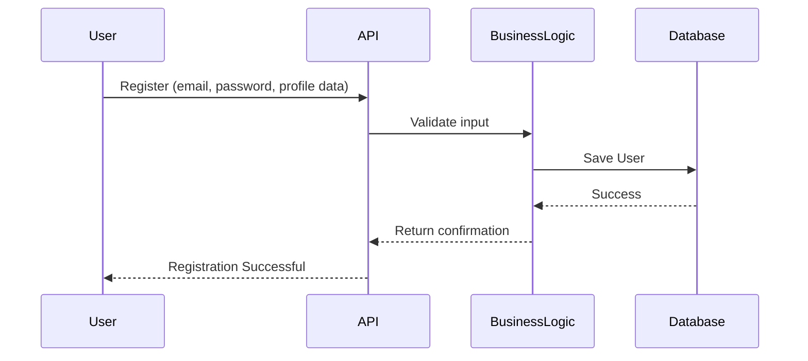
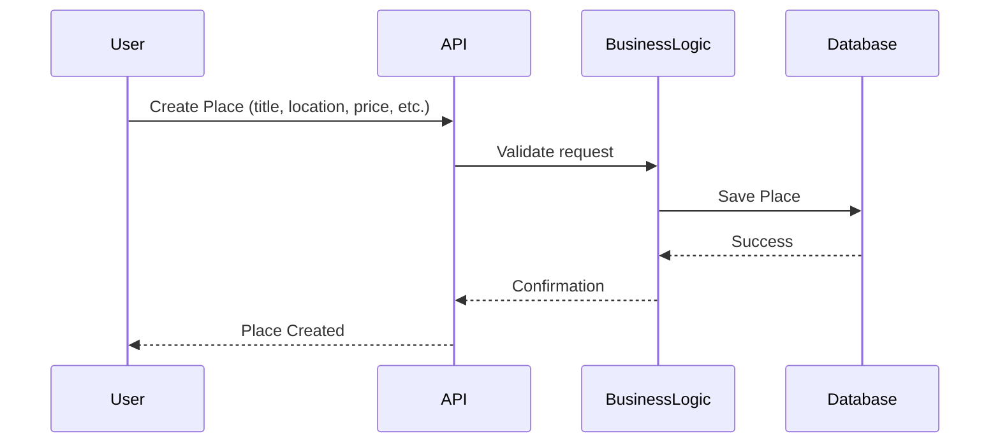
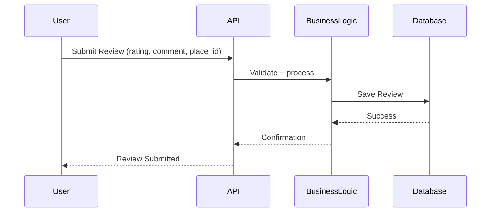

# HBnB Project - Technical Documentation

## Introduction

### Purpose and Scope
This document serves as the technical blueprint for the HBnB project. It compiles all architectural diagrams and explanatory notes created in Tasks 1–3 into a single reference document. Its purpose is to guide implementation, ensure design consistency, and serve as documentation for developers and stakeholders.

### 🌍 Project Overview
HBnB is a modular, web-based property rental and management platform inspired by AirBnB. The system follows a layered architecture to ensure scalability, maintainability, and clarity.

**Key design goals:**
- Separation of concerns between layers
- Clear object-oriented design in the business logic layer
- RESTful API interactions with well-defined flows
- Security, extensibility, and robustness

### 📖 Document Structure
This document is organized as follows:

- **🔹 High-Level Architecture**: Package diagram + explanation of layers
- **🔹 Business Logic Layer**: Class diagram of core entities
- **🔹 API Interaction Flow**: Sequence diagrams of API calls
- **🔹 Explanatory Notes**: Key design decisions and rationale

---

## 🔹 High-Level Architecture

### 🏗 Overview
The HBnB system is designed using a layered architecture pattern with a facade at the business logic entry point.

- **📌 Presentation Layer**: Web UI and REST API endpoints
- **📌 Business Logic Layer**: Application services, rules, and validation
- **📌 Persistence Layer**: Database and repositories
- **📌 Infrastructure Layer**: Support services (security, caching, etc.)

### 📊 High-Level Package Diagram

*This diagram illustrates the three-layer architecture of the HBnB system, showing the relationships between the Presentation Layer (ServiceAPI), Business Logic Layer (Processor), and Persistence Layer (Repositories).*

---

## 🔹 Business Logic Layer

### 📊 Class Diagram

*This detailed class diagram shows the core entities of the HBnB system: User, Place, Review, and Amenity. It illustrates their attributes, methods, and relationships including one-to-many and many-to-many associations.*

---

## 🔹 API Interaction Flow

### 📝 Sequence Diagrams

#### 1️⃣ User Registration

#### 2️⃣ Place Creation

#### 3️⃣ Review Submission

---

## 🔹 Explanatory Notes

- **Layered Architecture** ensures modularity and maintainability.
- **Object-Oriented Modeling** defines clear entities (User, Place, Review, Amenity).
- **RESTful API interaction flows** clarify request/response lifecycle.
- **Security Considerations**: Token-based authentication, hashed passwords, validation rules.
- **Scalability**: New services or entities can be added without breaking the architecture.

---

## 📌 Conclusion

This document compiles the core architecture and design documentation of the HBnB project. It integrates package diagrams, class diagrams, and sequence diagrams with explanations. It will serve as the reference point for developers throughout implementation.

---

## ✍️ Authors
- **Haifa Bin Hasher**
- **Sultan Alsanie**
