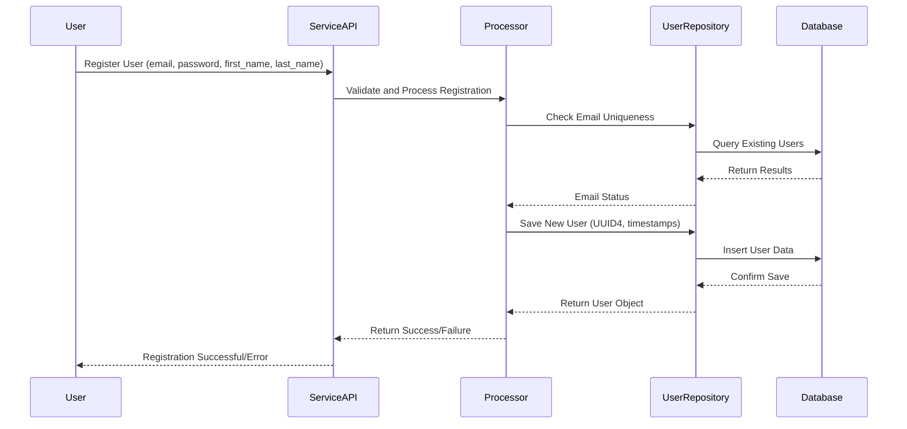
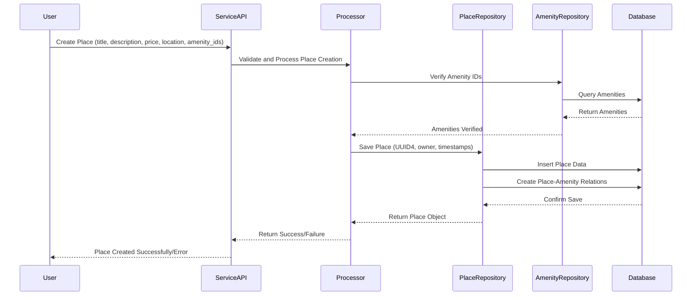
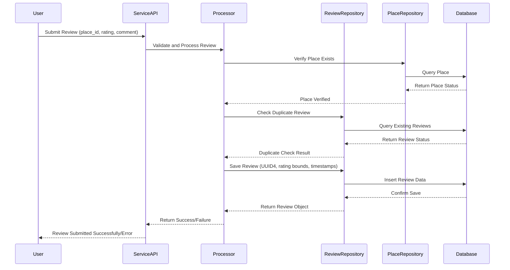
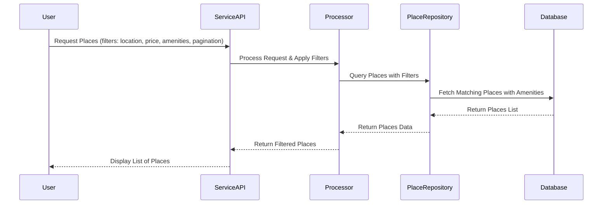

# Sequence Diagrams for API Calls

## Objective
The following sequence diagrams illustrate the interaction between the different layers (Presentation, Business Logic, and Persistence) in the HBnB application for handling various API calls.

## API Calls

### 1. User Registration

**Explanation:**
- The user sends a registration request to the ServiceAPI.
- The ServiceAPI forwards the request to the Processor for validation and processing.
- The Processor checks email uniqueness via UserRepository.
- A new user is created with UUID4 ID and timestamps.
- The user data is stored in the database through UserRepository.
- A response is returned to the user indicating success or failure.

### 2. Place Creation

**Explanation:**
- The user submits a request to create a place with amenities.
- The ServiceAPI routes the request to Processor for validation.
- The Processor verifies amenity IDs through AmenityRepository.
- A new place is created with UUID4 ID, owner linkage, and timestamps.
- The place and its amenity relationships are stored in the database.
- The API responds to the user with the creation outcome.

### 3. Review Submission

**Explanation:**
- The user submits a review for a specific place.
- The ServiceAPI processes the request via the Processor layer.
- The Processor verifies the place exists and checks for duplicate reviews.
- A new review is created with UUID4 ID, rating validation (1-5), and timestamps.
- The review is stored in the database through ReviewRepository.
- The process concludes with a response to the user.

### 4. Fetching a List of Places

**Explanation:**
- The user requests a list of places based on various filters.
- The ServiceAPI forwards the request to Processor for processing.
- The Processor applies filters and queries the database via PlaceRepository.
- The filtered results with amenities are returned through the ServiceAPI to the user.

## Key Design Patterns Demonstrated

- **UUID4 Primary Keys**: All entities use UUID4 for unique identification
- **Timestamp Tracking**: `CreatedAt` and `UpdatedAt` fields on all entities
- **Owner Relationship**: Places are linked to their creating user via `owner` field
- **Rating Validation**: Reviews enforce rating bounds (1-5)
- **Many-to-Many Relations**: Place-Amenity relationship via junction table
- **Business Rule Enforcement**: Duplicate review prevention, email uniqueness
- **Geospatial Filtering**: Location-based place queries with radius support
- **Pagination**: Standardized pagination with metadata 