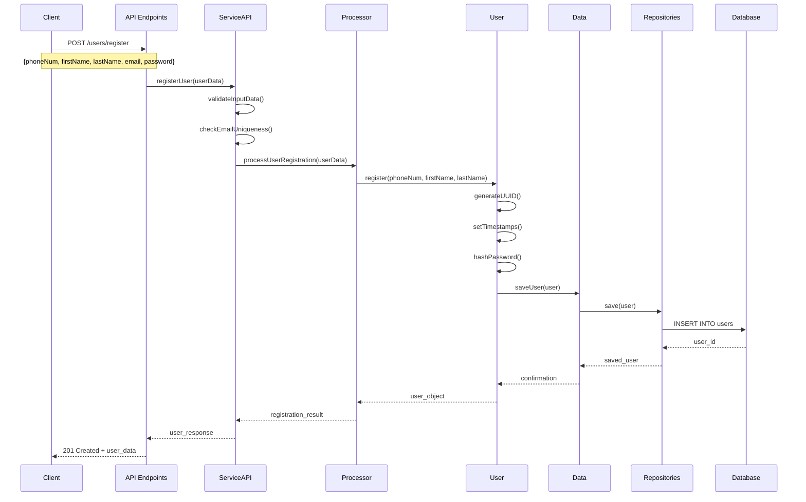
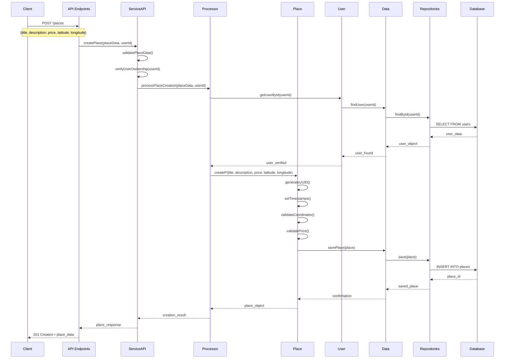
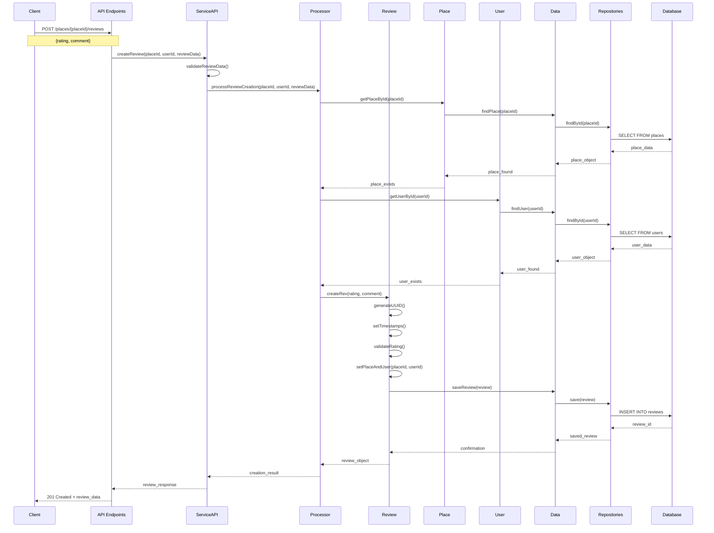
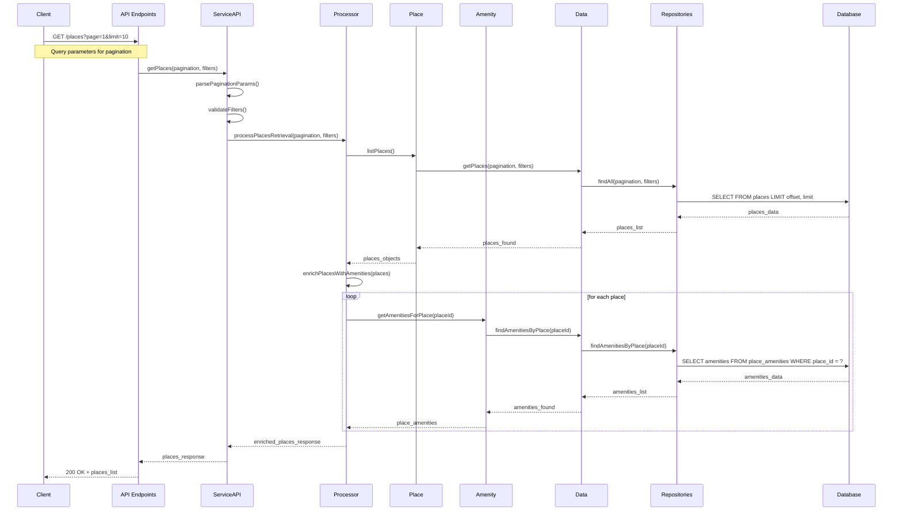

# Sequence Diagrams for HBnB Evolution API Calls

## Overview
These sequence diagrams illustrate the interaction flow between the different layers of the HBnB Evolution application based on the three-layer architecture with facade patterns.

## 1. User Registration Sequence Diagram

## 2. Place Creation Sequence Diagram

## 3. Review Submission Sequence Diagram

## 4. Fetching Places List Sequence Diagram

## API Call Descriptions

### 1. User Registration
**Purpose**: Allows new users to create accounts in the system
**Key Steps**:
- Input validation and email uniqueness check through ServiceAPI
- User creation via Processor facade
- Password hashing and UUID generation
- Data persistence through Data facade

### 2. Place Creation
**Purpose**: Enables users to list their properties
**Key Steps**:
- User ownership verification
- Place data validation (coordinates, price)
- Place creation with geographic constraints
- Data persistence with proper relationships

### 3. Review Submission
**Purpose**: Allows users to provide feedback on places they've visited
**Key Steps**:
- Verification of place and user existence
- Review data validation (rating range 1-5)
- Review creation with proper associations
- Data persistence with foreign key relationships

### 4. Fetching Places List
**Purpose**: Retrieves a paginated list of places with amenities
**Key Steps**:
- Pagination parameter parsing and validation
- Places retrieval through Processor facade
- Amenity enrichment for each place
- Response with complete place information

## Architecture Patterns Demonstrated

- **Facade Pattern**: ServiceAPI, Processor, and Data facades simplify layer interactions
- **Repository Pattern**: Data access abstraction through Repositories
- **Service Layer Pattern**: Business logic coordination through Services
- **Validation Pattern**: Input verification at multiple levels
- **Enrichment Pattern**: Adding related data (amenities) to responses 