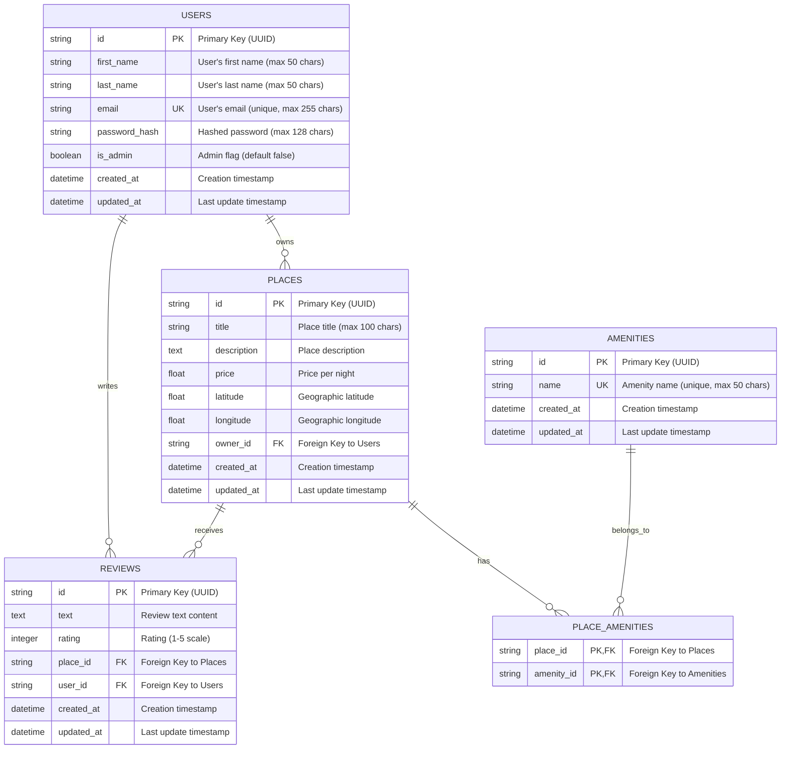
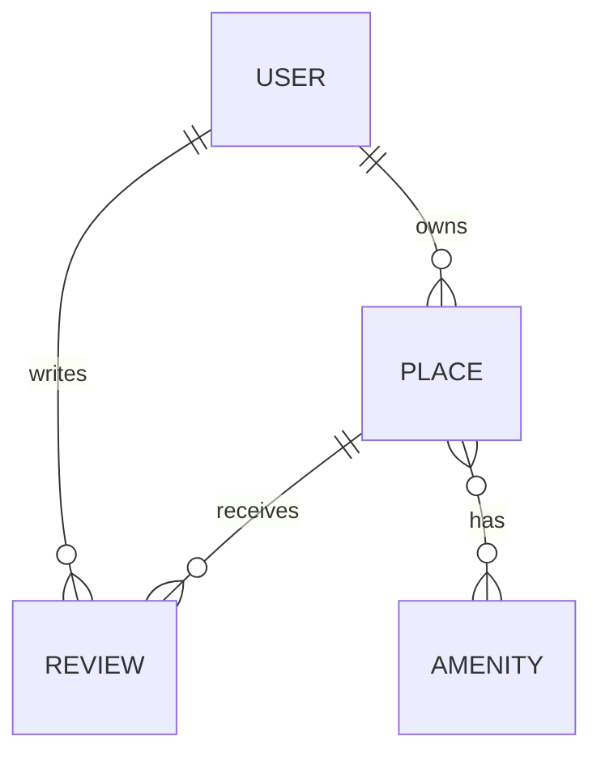
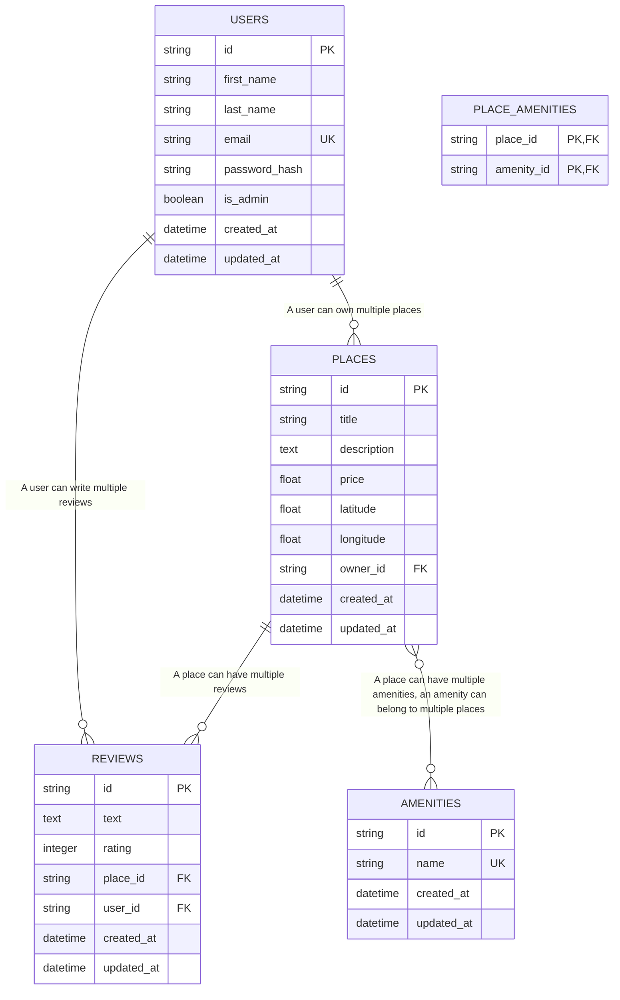
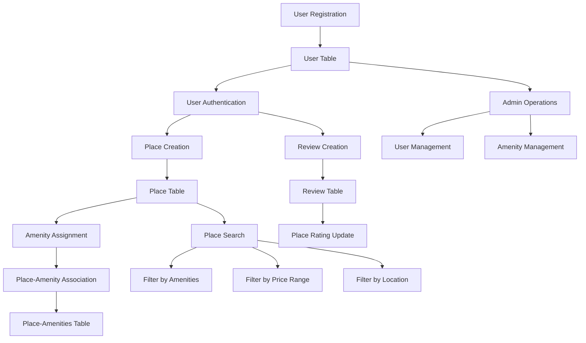
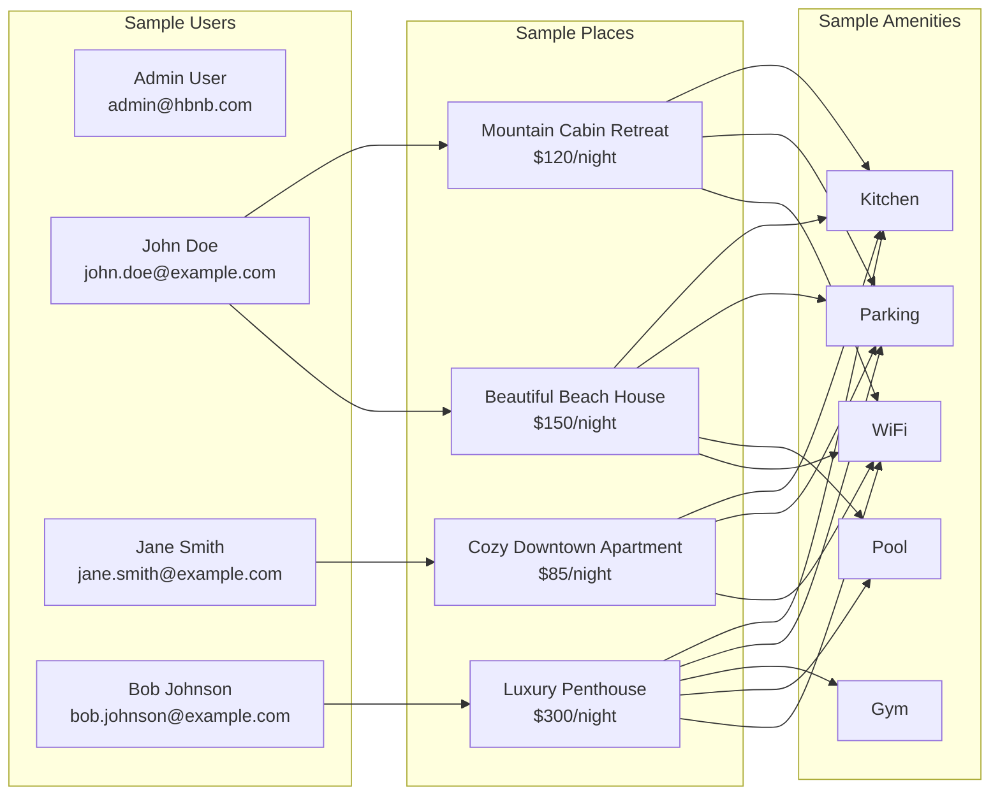

# HBnB Database Schema Diagrams

This document contains Entity-Relationship (ER) diagrams for the HBnB project database schema using Mermaid.js.

## Complete Database Schema

## Simplified Entity Overview

## Detailed Relationship Diagram

## Database Constraints and Indexes

```mermaid
graph TD
    A[Database Constraints] --> B[Primary Keys]
    A --> C[Foreign Keys]
    A --> D[Unique Constraints]
    A --> E[Check Constraints]
    A --> F[Indexes]

    B --> B1[users.id]
    B --> B2[places.id]
    B --> B3[amenities.id]
    B --> B4[reviews.id]
    B --> B5[place_amenities composite PK]

    C --> C1[places.owner_id → users.id]
    C --> C2[reviews.place_id → places.id]
    C --> C3[reviews.user_id → users.id]
    C --> C4[place_amenities.place_id → places.id]
    C --> C5[place_amenities.amenity_id → amenities.id]

    D --> D1[users.email UNIQUE]
    D --> D2[amenities.name UNIQUE]

    E --> E1[reviews.rating BETWEEN 1 AND 5]
    E --> E2[places.price > 0]
    E --> E3[places.latitude BETWEEN -90 AND 90]
    E --> E4[places.longitude BETWEEN -180 AND 180]

    F --> F1[users.email INDEX]
    F --> F2[places.owner_id INDEX]
    F --> F3[reviews.place_id INDEX]
    F --> F4[reviews.user_id INDEX]
    F --> F5[amenities.name INDEX]
```

## Data Flow Diagram

## Sample Data Relationships

## Database Schema Summary

### Tables:
1. **users** - Stores user information including authentication data
2. **places** - Stores property listings with location and pricing
3. **amenities** - Stores available amenities (WiFi, Pool, etc.)
4. **reviews** - Stores user reviews and ratings for places
5. **place_amenities** - Junction table for many-to-many relationship between places and amenities

### Key Relationships:
- **One-to-Many**: User → Places (a user can own multiple places)
- **One-to-Many**: User → Reviews (a user can write multiple reviews)
- **One-to-Many**: Place → Reviews (a place can have multiple reviews)
- **Many-to-Many**: Place ↔ Amenities (places can have multiple amenities, amenities can belong to multiple places)

### Security Features:
- Password hashing using bcrypt
- Email uniqueness constraints
- Admin role-based access control
- Foreign key constraints for data integrity

### Performance Optimizations:
- Indexes on frequently queried columns (email, owner_id, place_id, user_id)
- Proper foreign key relationships for efficient joins
- Composite primary key for junction table
